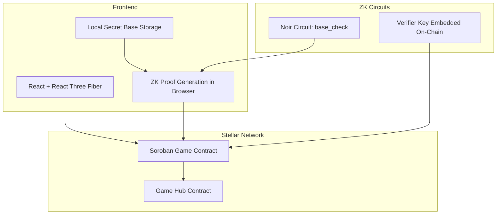
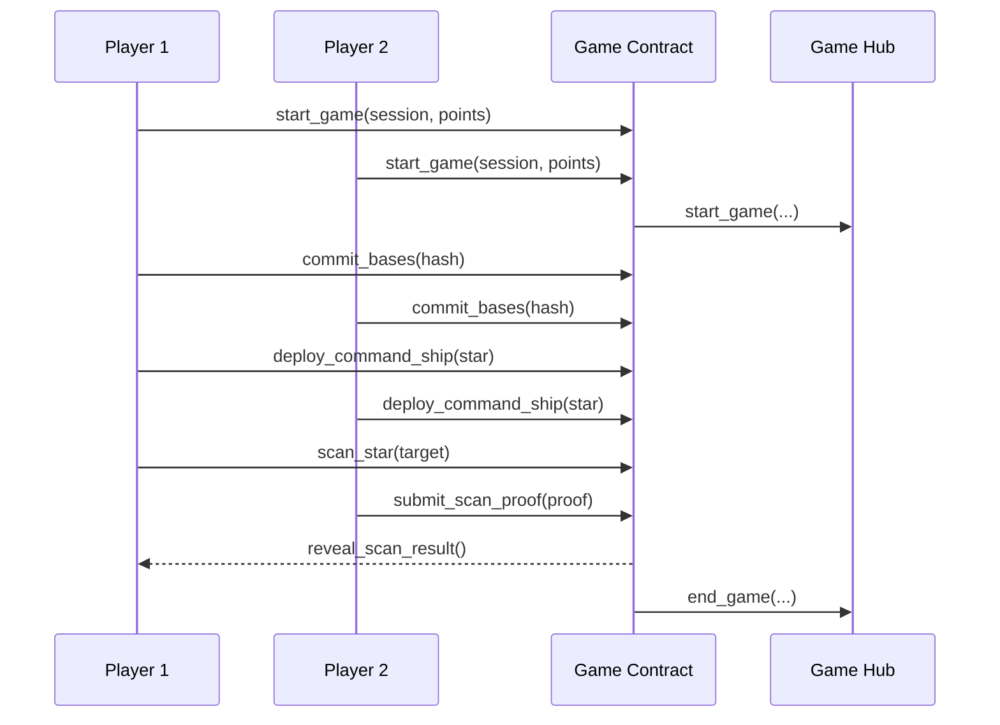

# BUIDL: The Resistance

## TL;DR
**The Resistance** is a two‑player, ZK‑powered, 3D galactic strategy game on Stellar. Players secretly place bases, then use verifiable scans to hunt the opponent without revealing hidden positions. The result is a trustless, competitive experience where privacy and fairness are guaranteed by zero‑knowledge proofs, and the game feels like a modern 3D multiplayer title rather than a crypto demo.

---

## Vision
Build a **trustless, tactical multiplayer** game where **private information stays private**, yet **every action is provably fair**. We want players to feel the tension of a classic fog‑of‑war strategy game, but with cryptographic integrity: you can’t lie about a scan result and you can’t leak your base locations.

---

## What We Built

### 1) A ZK‑Verified Core Loop
- **Secret base placement** committed on‑chain via Poseidon hash.
- **Public command ship** position establishes scan range.
- **Scan action** returns proof: “target star is (or isn’t) a base.”
- **On‑chain verification** of ZK proofs guarantees honest results without revealing secrets.

### 2) Stellar + Soroban Game Contracts
- Game state lives on‑chain with deterministic rules.
- **Game Hub** standardizes lifecycle: `start_game` → `end_game`.
- **Deterministic randomness** ensures simulation matches submission.
- **Temporary storage + TTL** for efficient state management.

### 3) A 3D Galaxy Frontend
- Interactive **React Three Fiber** galaxy map.
- Tactical HUD for moves, scans, intel, and battle log.
- Client‑side ZK proving in the browser.

### 4) Full Studio Tooling
- One‑command scaffolding for **contracts + frontend**.
- Deployment + binding generation scripts.
- A template game for rapid iteration.

---

## Architecture

### High‑Level System

### On‑Chain Game Lifecycle

---

## Gameplay Mechanics (Concise)

### Setup Phase
- **Galaxy Generation:** 200 stars in a spiral pattern, deterministic per session.
- **Base Placement:** each player selects 5 bases, committed with Poseidon hash (never revealed).
- **Command Ship:** public position, defines scan range.

### Combat Phase (Turn‑Based)
Each turn choose one action:
- **MOVE:** move command ship within range.
- **SCAN:** target a star within range; opponent proves whether it’s a base.

### Victory
- First to destroy **3 of 5** enemy bases wins.
- Forfeit or timeout ends the game.

---

## Why ZK Matters
Without ZK, players can lie. With ZK:
- The scan result is **provably correct**.
- **No base positions** are revealed on‑chain.
- The contract verifies everything without learning secrets.

This enables **competitive trustless play** without sacrificing strategic privacy.

---

## Deterministic Randomness
Randomness is derived from **session inputs + cryptographic hashing**, not ledger time. This ensures **simulations match on‑chain submission** and prevents desyncs or exploitation.

---

## Tech Stack
- **Soroban (Rust)** for game contracts.
- **Noir + Barretenberg (bb)** for ZK proofs.
- **React + Three Fiber** for 3D UI.
- **Bun scripts** for automation (build, deploy, bindings).

---

## What Makes It Exciting
- **Real gameplay depth**: fog‑of‑war, deception, positioning.
- **ZK as a gameplay feature**, not just infrastructure.
- **3D experience** that feels like a modern strategy title.
- **Composable studio tooling** for future games.

---

## Repo Pointers
- `contracts/` Soroban game contracts + mock Game Hub
- `circuits/` ZK circuit source and artifacts
- `the-resistance-frontend/` standalone game frontend
- `scripts/` deployment + bindings automation

---

## Status
Core architecture, gameplay specification, ZK flow, and contract patterns are defined and implemented in the repo. The build pipeline supports rapid iteration and deployment.

---

## Short Pitch
**The Resistance** is a privacy‑preserving, competitive multiplayer strategy game on Stellar where zero‑knowledge proofs make fog‑of‑war fair. It’s part of a broader game studio toolkit that proves web3 games can feel as polished and tactical as mainstream titles.
