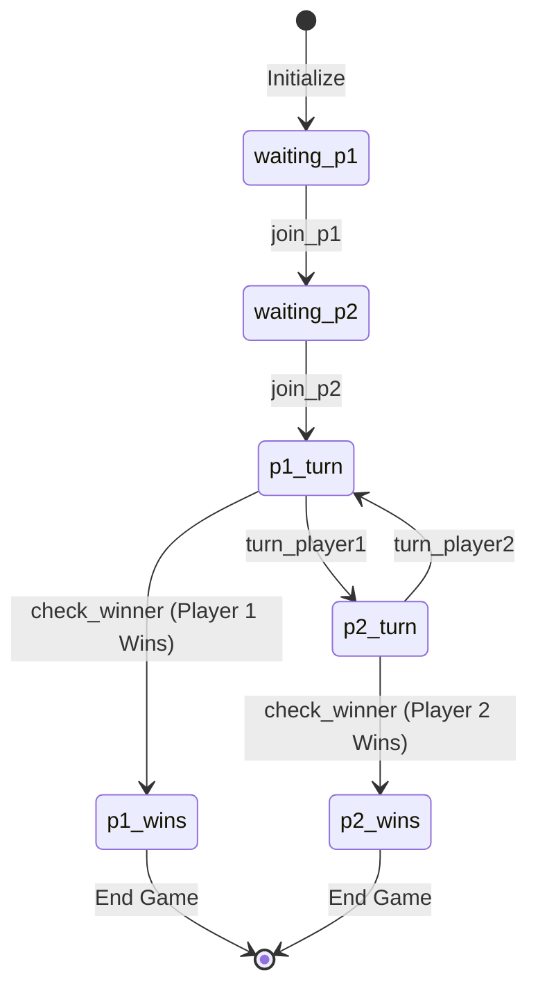

# Midnight Sea Battle - Reference Project Breakdown

## Overview

**Project Name:** Brick Towers Sea Battle Game
**Blockchain:** Midnight Network (Zero-Knowledge proof blockchain)
**Game Type:** Classic Battleship - Two-player strategic naval combat
**Live Demo:** https://seabattle.midnight.solutions

This is a privacy-preserving implementation of Battleship using Zero-Knowledge (ZK) proofs on the Midnight blockchain. The key innovation is that ship positions remain entirely private in the player's browser - never shared with anyone, not even encrypted - while still enforcing fair gameplay through ZK proofs.

---

## Architecture

### High-Level Stack

```
+------------------+     +------------------+     +------------------+
|   battleship-ui  | --> |  battleship-api  | --> |  Midnight Chain  |
|   (React/Vite)   |     |   (TypeScript)   |     | (Compact Runtime)|
+------------------+     +------------------+     +------------------+
         |                        |                        ^
         |                        v                        |
         |               +------------------+              |
         +-------------> | battleship-west  |<-------------+
                         | battleship-east  |
                         |   (Contracts)    |
                         +------------------+
                                  |
                         +------------------+
                         | token-contract   |
                         |   (tBTC Token)   |
                         +------------------+
```

### Module Structure

| Module | Purpose | Language |
|--------|---------|----------|
| `compact/` | Compact compiler wrapper | JavaScript |
| `battleship-contract-commons/` | Shared contract code (GameCommons.compact) | Compact |
| `battleship-west-contract/` | Western variant contract (5 ships) | TypeScript + Compact |
| `battleship-east-contract/` | Eastern variant contract (10 ships) | TypeScript + Compact |
| `battleship-api/` | High-level API for contract interaction | TypeScript |
| `battleship-ui/` | React frontend with Material UI | TypeScript/React |
| `battleship-indexer/` | Blockchain state indexer for Firebase | TypeScript |
| `token-contract/` | Brick Towers Coin (tBTC) token | TypeScript + Compact |

---

## Smart Contract Architecture (Compact Language)

### Compact Language Overview

Compact is Midnight's domain-specific language for writing ZK-enabled smart contracts. Key features:
- **Pure circuits**: ZK proof generation happens client-side
- **Ledger state**: Public on-chain state
- **Witness data**: Private data that proves statements without revealing values

### GameCommons.compact - Shared Types & Circuits

```compact
// Core enums
enum GAME_STATE { waiting_p1, waiting_p2, p1_turn, p2_turn, p1_wins, p2_wins }
enum SHOT_RESULT { miss, ship_hit, ship_sunk }
enum SHIP { s11, s12, s13, s14, s21, s22, s23, s31, s32, s41, s51, unknown }

// Core structures
struct Coord { x: Uint<4>; y: Uint<4>; }  // 4-bit coordinates (0-15)
struct ShipDef { ship: SHIP; ship_cell: Coord; ship_v: Boolean; }
struct ShotResult { cell: Coord; result: SHOT_RESULT; player: Bytes<32>; ship_def: ShipDef; }

// Pure circuits for ship cell calculations
pure circuit ship2_cells(cell: Coord, vertical: Boolean): Vector<2, Coord>
pure circuit ship3_cells(cell: Coord, vertical: Boolean): Vector<3, Coord>
pure circuit ship4_cells(cell: Coord, vertical: Boolean): Vector<4, Coord>
pure circuit ship5_cells(cell: Coord, vertical: Boolean): Vector<5, Coord>

// Public key derivation from private secret key
pure circuit public_key(sk: Bytes<32>): Bytes<32> {
    return persistentHash<Vector<2, Bytes<32>>>([pad(32, "battleship:pk:"), sk]);
}
```

### Game State Machine



### Contract Variants

**Western Variant (5 ships - exposed in UI):**
- 1x Destroyer (length 2)
- 2x Cruiser/Submarine (length 3)
- 1x Battleship (length 4)
- 1x Aircraft Carrier (length 5)
- Ships can be adjacent but not overlapping

**Eastern Variant (10 ships - contract only):**
- 4x Submarines (length 1)
- 3x Destroyers (length 2)
- 2x Cruisers (length 3)
- 1x Battleship (length 4)
- Ships must NOT be adjacent (buffer zone required)

---

## Private State Management

### The Zero-Knowledge Pattern

The key innovation is how ship positions are kept private:

```typescript
// Private state structure
type BattleshipPrivateState = {
  readonly localSecretKey: Uint8Array;      // Player's private identity
  readonly playerShipPositions: Ships;       // Ship placement (NEVER shared)
  readonly playerShipState?: ShipState;      // Current hit/sunk state
};

// Witnesses - functions that access private state for ZK proofs
const westWitnesses = {
  // Prove identity without revealing secret key
  local_secret_key: ({ privateState }) => [privateState, privateState.localSecretKey],

  // Access ship positions for hit detection
  player_ship_positions: ({ privateState }) => [privateState, privateState.playerShipPositions],

  // Track which cells have been hit
  player_ship_state: ({ privateState }) => [privateState, privateState.playerShipState],

  // Update ship state after a hit
  set_player_ship_state: ({ privateState }, newState) => [{ ...privateState, playerShipState: newState }, []],
};
```

### How ZK Proofs Work Here

1. **Board Setup**: Player places ships in browser, stored ONLY locally
2. **Game Join**: Player commits hash of ship positions to blockchain
3. **Taking Turns**:
   - Opponent guesses a coordinate
   - Player's browser generates ZK proof that "yes/no, there is/isn't a ship here"
   - Proof verifies without revealing ANY ship positions
4. **Ship Sunk**: When all cells of a ship are hit, the ship definition is revealed

---

## API Layer (battleship-api)

### BattleshipAPI Class

```typescript
class BattleshipAPI implements DeployedBattleshipAPI {
  // Observable state stream - combines ledger + private state + user actions
  readonly state$: Observable<BattleshipDerivedState>;

  // Contract interactions
  async turn_player1(value: Coord): Promise<void>;
  async turn_player2(value: Coord): Promise<void>;
  async join_p1(): Promise<void>;
  async join_p2(): Promise<void>;
  async set_board(ships: Ships): Promise<void>;

  // Factory methods
  static async deploy(gameId, tokenAddress, providers, logger): Promise<BattleshipAPI>;
  static async subscribe(gameId, tokenAddress, providers, contractAddress, logger): Promise<BattleshipAPI>;
}
```

### Derived State

The API combines multiple data sources into a unified state:

```typescript
type BattleshipDerivedState = {
  state: GAME_STATE;           // Current game phase
  p1?: string;                  // Player 1 public key
  p2?: string;                  // Player 2 public key
  whoami: string;               // Current user's public key
  shotAttempt: Coord;           // Pending shot
  lastShotResult?: LastShotResult;
  p1Board: BOARD_STATE[][];     // 10x10 board visualization
  p2Board: BOARD_STATE[][];
  privateShips?: Ships;         // Only visible to owner
  p1PartialShips: PartialShips; // Revealed sunk ships
  p2PartialShips: PartialShips;
  lastTurn?: PlayerHit;
};
```

---

## Frontend Architecture (battleship-ui)

### Technology Stack

- **React 18** with TypeScript
- **Vite** for bundling
- **Material UI** for components
- **React DnD** for drag-and-drop ship placement
- **RxJS** for reactive state management
- **Pino** for logging

### Context Providers

```
App
├── RuntimeConfigurationProvider  (config.json settings)
│   └── ThemeProvider             (Material UI theme)
│       └── DndProvider           (Drag & Drop)
│           └── GameLocalStateProvider  (IndexedDB persistence)
│               └── MidnightWalletProvider  (Lace wallet connection)
│                   └── DeployedGameProvider  (Contract API management)
│                       └── Routes
```

### Key Components

| Component | Purpose |
|-----------|---------|
| `App.tsx` | Root component with providers and routing |
| `MyBattles.tsx` | Game lobby - list/create/join games |
| `Setup.tsx` | Drag-and-drop ship placement board |
| `Game.tsx` | Main gameplay - two boards, turn management |
| `Board.tsx` | 10x10 grid component |
| `BattleshipGameBoard.tsx` | Board with ships overlay |
| `MidnightWallet.tsx` | Lace wallet integration |
| `WalletWidget.tsx` | Connection status UI |

### Routes

| Path | Component | Purpose |
|------|-----------|---------|
| `/` | MyBattles | Game lobby |
| `/game/:contract` | Game | Play/spectate game |
| `/setup/:contract` | Setup | Place ships before joining |
| `/faq` | FAQ | Help documentation |

---

## Token System

### Brick Towers Coin (tBTC)

- **Purpose**: Prize pool token for games
- **Entry Fee**: 100 tBTC per player
- **Winner**: Receives entire pool (200 tBTC)
- **Acquisition**: Faucet available on game page

The token contract address is passed during game deployment:

```typescript
// During contract deployment
await deployContract(providers, {
  privateStateId: gameId,
  contract: battleshipContract,
  initialPrivateState: await BattleshipAPI.getPrivateState(gameId, providers.privateStateProvider),
  args: [{ bytes: encodeContractAddress(tokenContractAddress) }],
});
```

---

## Indexer System

### Purpose

The indexer monitors the Midnight blockchain for Sea Battle contracts and publishes state to Firebase for:
- Real-time game discovery
- Game state notifications
- Spectator mode support

### Architecture

```typescript
// Indexer flow
const stream = from(storage.getBlockHeight()).pipe(
  concatMap((blockHeight) => battleshipStateStream.contractUpdateStateStream(blockHeight)),
  retry({ count: 10, delay: 500, resetOnSuccess: true }),
  mergeMap(async (element) => {
    await Promise.all(element.contracts.map((contract) => storage.saveContract(contract)));
    return element;
  }),
  mergeMap(async (element) => {
    if (element.height % 100 === 0 || element.contracts.length > 0) {
      await storage.saveBlockHeight(element.height);
    }
    return element;
  }, 1),
);
```

---

## Configuration

### Runtime Config (config.json)

```json
{
  "NETWORK_ID": "TestNet",
  "INDEXER_URI": "https://indexer-rs.testnet-02.midnight.network/api/v1/graphql",
  "INDEXER_WS_URI": "wss://indexer-rs.testnet-02.midnight.network/api/v1/graphql/ws",
  "NODE_URI": "...",
  "PROOF_SERVER_URI": "...",
  "BRICK_TOWERS_TOKEN_ADDRESS": "...",
  "LOGGING_LEVEL": "info"
}
```

---

## Key Differences from Stellar Game Studio

| Aspect | Midnight Sea Battle | Stellar Game Studio |
|--------|--------------------|--------------------|
| **Blockchain** | Midnight (ZK-enabled) | Stellar (Soroban) |
| **Smart Contract Language** | Compact | Rust |
| **Privacy** | ZK proofs for ship positions | No native privacy |
| **State Storage** | Ledger + Local Private State | On-chain (temporary) |
| **Token System** | tBTC (in-game token) | Points via Game Hub |
| **Game Discovery** | Firebase Indexer | Direct contract calls |
| **Authentication** | Midnight Lace Wallet | Stellar wallets |
| **Build System** | Yarn + Turbo | Bun + Custom scripts |

---

## Porting Considerations

### What Needs Adaptation

1. **Contract Logic**: Compact -> Rust/Soroban
   - Replace ZK proofs with commit-reveal or trusted randomness
   - Use Game Hub pattern instead of token prize pool

2. **State Management**:
   - No private state in Soroban - need different approach for hidden ships
   - Options: commit-reveal hashing, trusted coordinator, or hybrid approach

3. **Frontend Integration**:
   - Replace Midnight wallet with Stellar wallet
   - Update contract bindings generation
   - Adapt to Stellar SDK patterns

4. **Indexer**:
   - May not be needed if using Game Hub's built-in tracking
   - Or build custom indexer for Soroban events

### What Can Be Reused

1. **UI Components**: Board, Setup, Game logic (with binding updates)
2. **Game State Machine**: Same state transitions work in both
3. **Ship Placement Logic**: Validation, intersection checks
4. **Board Rendering**: BOARD_STATE enum pattern

---

## File Structure Summary

```
midnight-seabattle/
├── compact/                     # Compact compiler setup
│   └── src/run-compactc.cjs
├── battleship-contract-commons/
│   └── GameCommons.compact      # Shared types & pure circuits
├── battleship-west-contract/
│   └── src/
│       ├── index.ts             # Contract exports & witnesses
│       └── managed/             # Generated contract bindings
├── battleship-east-contract/
│   └── src/
│       ├── index.ts             # Eastern variant
│       └── managed/
├── battleship-api/
│   └── src/
│       ├── index.ts             # BattleshipAPI class
│       ├── common-types.ts      # Type definitions
│       ├── commons.ts           # Board update logic
│       └── utils/               # Helpers
├── battleship-ui/
│   ├── public/config.json       # Runtime configuration
│   └── src/
│       ├── App.tsx              # Root component
│       ├── MyBattles.tsx        # Game lobby
│       ├── components/
│       │   ├── Game.tsx         # Main gameplay
│       │   ├── Setup.tsx        # Ship placement
│       │   ├── Board.tsx        # Grid component
│       │   └── ...
│       ├── contexts/            # React contexts
│       ├── hooks/               # Custom hooks
│       └── config/              # Theme & runtime config
├── battleship-indexer/
│   └── src/
│       ├── index.ts             # Indexer entry
│       ├── battleship-state-stream.ts
│       └── storage.ts           # Firebase integration
├── token-contract/
│   └── src/index.ts             # tBTC token
├── package.json                 # Workspace config
├── turbo.json                   # Build pipeline
└── docs/
    └── hackaton_notes.md        # Implementation notes
```

---

## Build & Development

```bash
# Install dependencies
yarn install

# Build all packages
npx turbo build

# Run tests
npx turbo test

# Start UI dev server
npm run battleship-ui

# Run local network (Docker)
docker compose -f undeployed-compose.yml up
```

---

## Summary

The Midnight Sea Battle is a sophisticated ZK-enabled game that demonstrates:
- **Privacy-preserving gameplay** via zero-knowledge proofs
- **Clean architecture** with separated concerns (contract/API/UI/indexer)
- **Reactive state management** using RxJS
- **Modern frontend stack** with React + TypeScript

For porting to Stellar Game Studio:
- The core game logic can be adapted
- Privacy will need a different approach (no native ZK)
- The Game Hub integration pattern should be used for points/sessions
- UI components can be largely reused with binding updates


Summary of What I Found
Reference Project: Midnight Sea Battle - a ZK-enabled Battleship game built on Midnight Network

Key Architecture Components:
Smart Contracts (Compact Language)

GameCommons.compact - Shared types, ship cell calculations, public key derivation
battleship-west-contract - Western variant (5 ships, adjacent allowed)
battleship-east-contract - Eastern variant (10 ships, no adjacency)
token-contract - tBTC prize pool token
API Layer (battleship-api)

BattleshipAPI class wrapping contract interactions
RxJS Observable state streams combining ledger + private state
Witness functions for ZK proof generation
Frontend (battleship-ui)

React + TypeScript + Material UI + Vite
React DnD for ship placement
Lace wallet integration
Context providers for game state management
Indexer (battleship-indexer)

Monitors blockchain for game contracts
Publishes to Firebase for real-time discovery
The Big Difference for Porting
The core innovation is ZK proofs for hidden ship positions - ships stay in browser localStorage, and proofs verify hits without revealing locations. Soroban doesn't have native ZK support, so porting will need:

A commit-reveal pattern (hash ship positions at start, reveal at end)
Or accept that ship positions must be public (simplified version)
Adapt to Game Hub pattern instead of token prize pools

---

# X-Ray Games - Reference Project Breakdown

## Overview

**Project Name:** xray.games
**Blockchain:** Stellar (Soroban)
**Live Demo:** https://xray.games
**Games:** Chain Slicer, Chain Snooker

A trustless arcade on Stellar where player skill is proven entirely onchain using ZK proofs. This is highly relevant as it demonstrates **ZK proofs on Stellar/Soroban** - exactly what we need for porting the Sea Battle concept.

---

## Key Innovation: ZK on Stellar

X-Ray Games uses **Groth16 ZK proofs** verified directly on Stellar using the new BN254 pairing primitives. This makes it possible to:
- Prove complex game computations offchain
- Verify proofs onchain with ~450k constraints
- Support both Circom and Noir circuits

### ZK Circuit Support

| Backend | Constraints | Compiled Size | Stellar Support |
|---------|-------------|---------------|-----------------|
| Circom  | 458,578     | 3.5MB         | Native (BN254)  |
| Noir    | 273,511     | 4.3MB         | Requires external verifier |

---

## Architecture

```
┌─────────────┐     ┌──────────────┐     ┌─────────────────┐
│   Browser   │────>│   Backend    │────>│ Soroban Contract│
│  (Frontend) │     │ (Optional)   │     │ + ZK Verifier   │
└─────────────┘     └──────────────┘     └─────────────────┘
       │                   │                      │
       │ Records replay    │ Generates proof      │ Verifies proof
       │ + commitment      │ (if delegated)       │ + updates state
       v                   v                      v
┌─────────────┐     ┌──────────────┐     ┌─────────────────┐
│ ZK Circuit  │     │  Poseidon2   │     │    Ohloss       │
│ (Noir/Circom)     │  Seed Gen    │     │  Integration    │
└─────────────┘     └──────────────┘     └─────────────────┘
```

### Trust Model

**The backend is a convenience layer, not a trust assumption:**
- Players can delegate proof generation to server
- OR download prover and submit directly to contract
- Poseidon2-seeded deterministic sessions
- Dual submission paths: direct trustless or server-delegated with commit/reveal

---

## Contract Structure

### Slicer Contract (ZK-enabled)

```rust
pub fn start(env: Env, player: Address, commitment: BytesN<32>, wager: i128) -> Session;
pub fn end(env: Env, player: Address, preimage: BytesN<32>, proof: Bytes, attestation: Bytes) -> u32;
```

**Key Pattern - Commit/Reveal:**
1. `start()` - Player commits hash of their gameplay
2. Game plays out client-side
3. `end()` - Player reveals preimage + submits ZK proof
4. Contract verifies commitment matches, then verifies ZK proof

### Snooker Contract (No ZK, physics-based)

```rust
pub fn start(env: Env, player: Address, commitment: BytesN<32>, wager: i128) -> Session;
pub fn end(env: Env, player: Address, preimage: BytesN<32>, shots: Vec<Ball>) -> u32;
```

Different approach - game state is deterministic based on shots, no ZK needed.

---

## ZK Verification on Soroban

### Groth16 Verifier (`common/src/zk.rs`)

```rust
pub fn verify_groth16(env: &Env, vk: &VerificationKeys, proof: &Bytes, inputs: &[U256]) -> bool {
    // Uses Stellar's native BN254 pairings
    let bn254 = env.crypto().bn254();

    // l = ic[0] + sum(inputs[i] * ic[i+1])
    let mut l = Bn254G1Affine::from_array(env, &vk.ic[0]);
    for i in 0..inputs.len() {
        let ic = Bn254G1Affine::from_array(env, &vk.ic[i + 1]);
        let scalar = Fr::from_u256(inputs[i].clone());
        let term = bn254.g1_mul(&ic, &scalar);
        l = bn254.g1_add(&l, &term);
    }

    // e(-a, b) * e(alpha, beta) * e(l, gamma) * e(c, delta) == 1
    bn254.pairing_check(g1, g2)
}
```

### Poseidon2 Seed Generation

```rust
pub fn generate(&self, player: &Address, nonce: u64) -> U256 {
    let addr = address_to_field(self.env, player);
    let nonce = u64_to_field(self.env, nonce);
    poseidon2_hash::<4, BnScalar>(self.env, &vec![self.env, addr, nonce])
}
```

---

## Ohloss Integration

Ohloss is a faction warfare protocol. X-Ray Games implements async matchmaking:

```rust
pub struct Ohloss<'a> {
    env: &'a Env,
    contract: Address,
    min_wager: i128,
    factions: [Address; 3],
}

impl Ohloss {
    pub fn start(&self, player: &Address, wager: i128, commitment: &BytesN<32>) -> u32;
    pub fn end(&self, session: u32, won: bool);
}
```

**Similar to our Game Hub pattern** - external contract handles matchmaking and wagers.

---

## Mainnet Contracts

| Contract | Address |
|----------|---------|
| Chain Slicer | `CD4XBH2QTIYJYGFEF6PGXPDL7HQRB2SL5Z2CHPJZMRCHMUHXH7J7YOLT` |
| Chain Snooker | `CBLPDJAKIDUSFUYTVI25HTR6G64J5NOMCVWEOAKW4DOLABJDZMYK4ZXJ` |

---

## Relevance for Sea Battle Port

**This is the perfect reference for porting Sea Battle to Stellar:**

1. **ZK Verification Works on Soroban** - BN254 pairings are available
2. **Commit/Reveal Pattern** - Same approach needed for hidden ships
3. **Ohloss Integration** - Similar to our Game Hub pattern
4. **Session Management** - Start/end lifecycle matches our games
5. **Deterministic Randomness** - Poseidon2 seeding pattern

---

# TypeZERO - Reference Project Breakdown

## Overview

**Project Name:** TypeZERO
**Blockchain:** Stellar (Soroban)
**ZK System:** RiscZero zkVM
**Game Type:** Typing speed competition with ZK-verified scores

A provably fair typing game where scores are cryptographically verified using RiscZero zero-knowledge proofs.

---

## Architecture

```
┌─────────────┐
│   Browser   │  Records replay (keystrokes + timing)
└──────┬──────┘
       │
       v
┌──────────────┐
│   Backend    │  RiscZero proof generation
│ Proving Svc  │
└──────┬───────┘
       │
       v
┌──────────────┐   ┌─────────────────┐
│ RiscZero VM  │-->│ Soroban Contract│
│    (Guest)   │   │ (Leaderboard)   │
└──────────────┘   └─────────────────┘
                           │
                           ├── Groth16 Verifier
                           └── Leaderboard
```

---

## What Gets Proven

Given a `challenge_id` and `prompt_hash`, the player possesses a replay that:
- Reconstructs text matching the prompt hash
- Satisfies timing constraints (no instant typing!)
- Produces claimed WPM, accuracy, score through deterministic computation

### Public Outputs Committed

- Challenge ID
- Player address
- Prompt hash
- Final score
- WPM (×100 for precision)
- Accuracy (basis points)
- Duration (milliseconds)
- Replay hash (for auditability)

---

## Anti-Cheat Constraints

The ZK guest program enforces:
- **Minimum keystroke interval**: ≥10ms between keys
- **Minimum total duration**: Based on prompt length (~40ms/char)

---

## Leaderboard Contract

```rust
pub fn submit_score(
    env: Env,
    challenge_id: u32,
    player: Address,
    name: String,
    prompt_hash: BytesN<32>,
    score: u64,
    wpm_x100: u32,
    accuracy_bps: u32,
    duration_ms: u32,
    journal_hash: BytesN<32>,
    image_id: BytesN<32>,
    seal: Bytes,
);
```

### Verification Flow

```rust
fn verify_proof(env: &Env, verifier_id: &Address, journal_hash: &BytesN<32>,
                image_id: &BytesN<32>, seal: &Bytes) {
    let result = env.try_invoke_contract::<Val, InvokeError>(
        verifier_id,
        &Symbol::new(env, "verify"),
        args
    );
    match result {
        Ok(Ok(_)) => {}
        _ => panic_with_error!(env, Error::ProofVerificationFailed),
    }
}
```

---

## Security Model

**Trustless Design:**
- Proofs generated using fixed RiscZero image ID
- Verification enforced by external verifier contract
- Only player's address can submit their own proof
- Replay determinism ensures same inputs → same outputs

**Backend CAN do:**
- Refuse to generate proofs (DoS)
- Be slow or rate-limit

**Backend CANNOT do:**
- Submit fake scores
- Submit on behalf of another player
- Modify replay results

---

## Tech Stack

| Layer | Technology |
|-------|------------|
| Blockchain | Stellar Soroban SDK 25.0.2 |
| ZK System | RiscZero zkVM + Groth16 |
| Verifier | Nethermind Groth16 contract |
| Frontend | Vanilla JS + Stellar SDK |

---

# Comparison: All Three Reference Projects

| Aspect | Midnight Sea Battle | X-Ray Games | TypeZERO |
|--------|---------------------|-------------|----------|
| **Blockchain** | Midnight | Stellar | Stellar |
| **ZK System** | Native (Compact) | Circom/Noir + BN254 | RiscZero + Groth16 |
| **Proof Location** | Browser | Browser or Server | Server |
| **Contract Language** | Compact | Rust (Soroban) | Rust (Soroban) |
| **Game Type** | 2-player turn-based | Single-player arcade | Single-player typing |
| **Hidden State** | Ship positions | Game replay | Keystroke replay |
| **External Integration** | Token prize pool | Ohloss factions | Leaderboard |

---

# Porting Strategy for Sea Battle

Based on all three references, the recommended approach:

## Option A: Full ZK (X-Ray Games Pattern)
1. Write Circom/Noir circuit for hit detection
2. Use BN254 pairings for onchain verification
3. Commit ship hash at game start
4. Submit ZK proof for each shot

**Pros:** True privacy, trustless
**Cons:** Complex circuit development, proof generation time

## Option B: Commit-Reveal (Simplified)
1. Hash ship positions at game start
2. Players commit shots
3. Reveal ships at game end for verification
4. Winner determined by honest completion

**Pros:** Simpler, faster development
**Cons:** Ships revealed at end, requires game completion

## Option C: Trusted Server (TypeZERO Pattern)
1. Server holds ship positions
2. Server validates hits
3. Game state recorded onchain
4. Server signs attestations

**Pros:** Fast, simple
**Cons:** Requires trust in server

## Recommended: Hybrid (X-Ray Games + Game Hub)

1. Use **commit-reveal** for ship positions (hash at start)
2. Use **ZK proofs** for hit verification (if Circom support added)
3. Integrate with **Game Hub** for sessions and points
4. Support **Ohloss-style** faction wagering